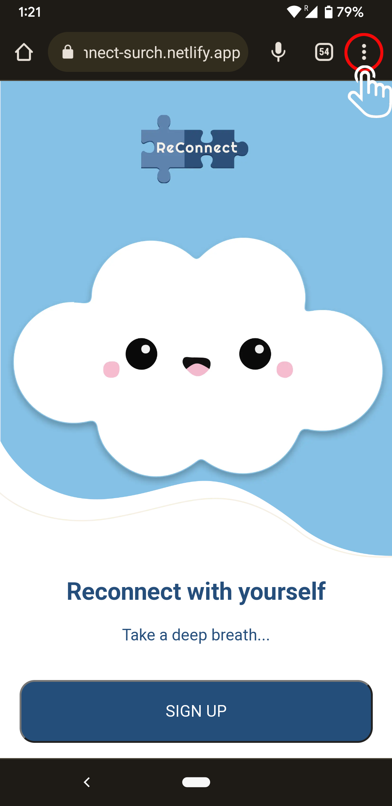
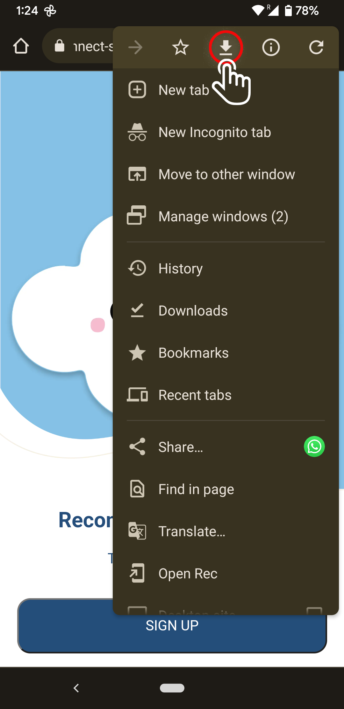
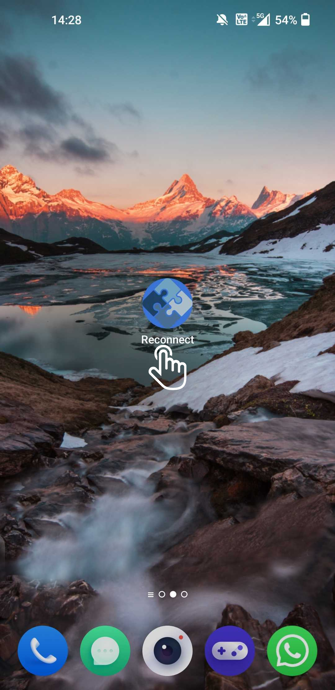

</img>

# Final Project - Reconnect by Team SURCH

## Index

- [How to download](#How-to-download-the-app-on-your-phone)
- [Who we are](#who-we-are)
- [Brief](#brief)
- [Project Description](#project-description)
- [Tech Stack](#tech-stack)
- [Colour and Font references](#colour-and-font-references)
- [Learning Journey](#learning-journey)
- [Testing](#testing)
- [Future Vision](#future-vision)
- [User Manual](#user-manual)
- [API reference](#api-reference)
- [Support and Feedback](#support-and-feedback)

<br/>

---

## Our [presentation](https://docs.google.com/presentation/d/1CVKoWleJ3tmRQn9C2ja9aKNRVN_qRFsWoKqKkcC-HQ8/edit?usp=sharing). 

## How to download the app on your phone

Here is the [URL](https://reconnect-surch.netlify.app/). for app.

On the top of your mobile, click on the kebab/ 3dots menu

<a></a>

Click on the download button. [download](https://ibb.co/QDSRJ2p)

<a></a>

After you're going to have an icon on your home for the reconnect app.

<a></a>

<br/>

---

## Who we are

[@Mohammed Ismail Ali](https://github.com/Ismailali99),\
[@Leigh-Eastell](https://github.com/Leigh-Eastell),\
[@Maria Roberta Araujo Moller](https://github.com/maroaraujo),\
[@Steven Cheung](https://github.com/StevenCK1),\
[@Wanteng Teoh](https://github.com/ten-hub)

<br/>

---

## Brief

The brief was to create an app that will solve a real world
problem people are facing and how technology could be used to solve it.
The decision was to make a wellness app that does not have a paywall blocking the majority of features as well as making it user friendly.

<br/>

---

## Project Description

Reconnect is a full stack self-care app that helps to keep track of your mood and thoughts, as well as to promote different activities to help develop healthy habits. In week 13 of our [School of Code](https://www.schoolofcode.co.uk/) bootcamp, we were challenged to build a full stack app within 4 weeks. We decided to come up with a self-care app for people who are experiencing different level anxiety and depression. Depression and anciety went up by more than 25% in the first year of pandemic alone. Even after the pandemic, there is only a small fraction of people in need have access to effective and affordable mental health care. The gaps in mental health services coverage ramin wide globally. The number of new digital health app are rising to meet the demand but a lot of them requires a payment and only offer a short trail period.
We aim to create a free self-care app that are accessible to teenagers and adults to help with better track their wellness and mental health, ultimately live a healthier lifetyles. Many of us are relying on apps to help meeting our daily goals and manage our life. Finding a beneficial self-care tool to help with our mental health shouldn't financial burden.
After ideating around this theme and identifying existing problems, we researched a lot of different mental health related app to help with the app fidelity frame. As the result, "Reconnect" is a React web app that allows you to track your mood and explore different healthy habits options for you to find one that suits your lifestyle.

<br/>

---

## Tech Stack

<a href="https://www.w3schools.com/css/" target="_blank" rel="noreferrer">  </a> <a href="https://www.w3.org/html/" target="_blank" rel="noreferrer">  </a> <a href="https://www.cypress.io" target="_blank" rel="noreferrer">  </a> <a href="https://expressjs.com" target="_blank" rel="noreferrer">  </a> <a href="https://www.figma.com/" target="_blank" rel="noreferrer">  </a> <a href="https://heroku.com" target="_blank" rel="noreferrer">  </a> <a href="https://developer.mozilla.org/en-US/docs/Web/JavaScript" target="_blank" rel="noreferrer">  </a> <a href="https://jestjs.io" target="_blank" rel="noreferrer">  </a> <a href="https://nodejs.org" target="_blank" rel="noreferrer">  </a> <a href="https://www.postgresql.org" target="_blank" rel="noreferrer">  </a> <a href="https://reactjs.org/" target="_blank" rel="noreferrer">  </a> <a></a> <a></a> <a></a> <a>  </a> <a></a> <a></a> <a></a> <a></a>

<br/>

---

## Colour and Font references

As part of the study, we searched for colors that evoke tranquility and relaxation. Our color palette was generated with different shades of blue to bring security and good energies to the user. We did contrast and colorblind tests for more accessibility.


<br/>

---

## Learning Journey

This was our first experience of as a group building our first full stack project within a month. This exercise aimed to apply all knowledge gained from the School of Code bootcamp, using our existing knowledge to experimenet something new, as well as learning and applying the following **skills**:

- Agile methodologies and tools
- Project planning & management
- UX/UI design processes
- Cooperation and decision making in a larger dev team

Having reflected on the project month as a team, we believe that our **strengths** included:

- Creating a strong team manifesto that helped us stay focused and keep momentum during decision-making phases.
- Creating an environment where all team members felt valued and could contribute.
- Designing a realistic and achievable MVP.
- Having daily stand-up and retrospect meetings to check in and plan next steps, keeping everyone on the same page.
- Every team member had the opportunity to be involved with each aspect of the project, resulting in an improved sense of understanding an ownership.

Thanks to these strengths, team morale remained high throughout the month and we were able to build a full-stack app that fulfilled our original brief and design.

**Lessons** to take forward to future projects:

- Although we wrote tests for the full project, testing should be given greater priority.
- Programming steps should be planned in great details but also be flexible at the same time.
- Constantly getting client feedback so that we can improve the app in development stage.
- Make sure our code is human-readable and organised.
- Always give the new technologies and framework a try.

<br/>

---

## Testing

The Reconnect app has been tested on both the front and back end. The back-end has been tested using jest with various unit tests throughout the different routes. This ensures that the routes are intact and flags any issues that may pop up.
The front end of the app has been tested using cypress. The user journey is mapped out on the software as you travel through different pages and submit a mood for the mood tracker. This makes sure that the path we expect users to take will be robust and work the way in which it has been designed.

<br/>

---

## Future Vision

There were many things that were omitted from the first iteration of this app. These are things that have been left as stretch goals and will be looked into implementing in the future.

- Support groups- an area in which users could find links to support groups or blogs to talk through issues.
- Crisis button- a button that will be rendered on every page to direct users to https://www.samaritans.org if ever needed.
- Push notifications- to send users notifications to remind them to complete daily tasks or send motivational quotes through the day, can be toggled.
- Self affirmation- a media player/sound player to listen to your favourite affirmations once a day to promote positive thinking.
- Favourites- activities would have a like feature which will add it to your favourites so you have quick access to them.
- Search function- make all the activities be filterable/searchable so you can find new things more easily.

<br/>

---

## User Manual

To run locally the project locally, please follow the intructions down below.

Clone the project

```bash
  git clone https://link-to-project
```

Go to the project directory

```bash
  cd reconnect
```

Install dependencies

```bash
  npm install
```

To start the front and back end

```bash
  npm run dev
```

<br/>

---

## API Reference

### Our API is hosted on [Heroku](https://reconnect-surch.herokuapp.com/)

<br/>

### **Mood Router**

<br/>

| Method | Path            | Additional Info                                                                           | Result                                    | Response                                                                 |
| ------ | --------------- | ----------------------------------------------------------------------------------------- | ----------------------------------------- | ------------------------------------------------------------------------ |
| GET    | /mood           |                                                                                           | Daily log of the user's mood              | { success: True, payload: User's mood array }                            |
| POST   | /mood           | { date: YYYY-MM-DD, mood: String, whatmakesfeel: String, notes: String , userId: Number } | Create a new entry of the user's mood     | { success: True, payload: User's mood entry object }                     |
| DELETE | /mood/<mood_id> |                                                                                           | Delete the user's mood entry at <mood_id> | { success: True, payload: The mood with id: <mood_id> has been deleted } |

### **Gratitude Router**

<br/>

| Method | Path                      | Additional Info                                         | Result                                              | Response                                                                           |
| ------ | ------------------------- | ------------------------------------------------------- | --------------------------------------------------- | ---------------------------------------------------------------------------------- |
| GET    | /gratitude                |                                                         | Log of the user's gratitude wall                    | { success: True, payload: User's gratitude array }                                 |
| POST   | /gratitude                | { gratitude: String, date: YYYY-MM-DD, userId: Number } | Create a new entry for the user's gratitude wall    | { success: True, payload: User's gratitude entry object }                          |
| DELETE | /gratitude/<gratitude_id> |                                                         | Delete the user's gratitude entry at <gratitude_id> | { success: True, payload: The gratitude with id: <gratitude_id> has been deleted } |

### **Achievement Router**

<br/>

| Method | Path                          | Additional Info                                              | Result                                 | Response                                                                           |
| ------ | ----------------------------- | ------------------------------------------------------------ | -------------------------------------- | ---------------------------------------------------------------------------------- |
| GET    | /achievement                  |                                                              | All achievement of the week            | { success: True, payload: achievement array }                                      |
| PUT    | /achievement/<achievement_id> | { achievement: String, completion: Boolean, userId: Number } | Update achievement by <achievement_id> | { success: True, payload: You have updated achievement with id: <achievement_id> } |

---

<br/>

## Support and Feedback

To receive support or give feedback, please contact team members through details provided on their Github profiles:

[@Mohammed Ismail Ali](https://github.com/Ismailali99),\
[@Leigh-Eastell](https://github.com/Leigh-Eastell),\
[@Maria Roberta Araujo Moller](https://github.com/maroaraujo),\
[@Steven Cheung](https://github.com/StevenCK1),\
[@Wanteng Teoh](https://github.com/ten-hub)
